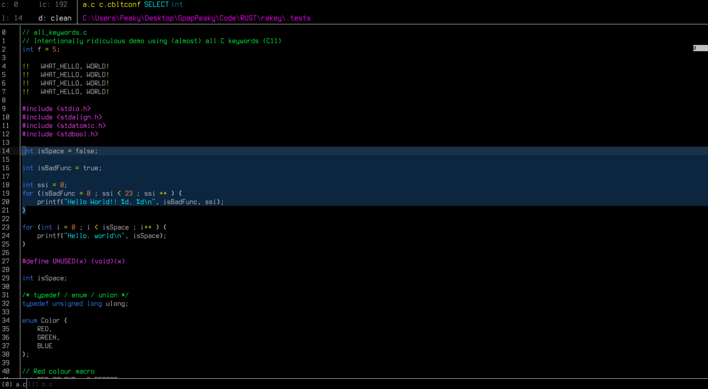
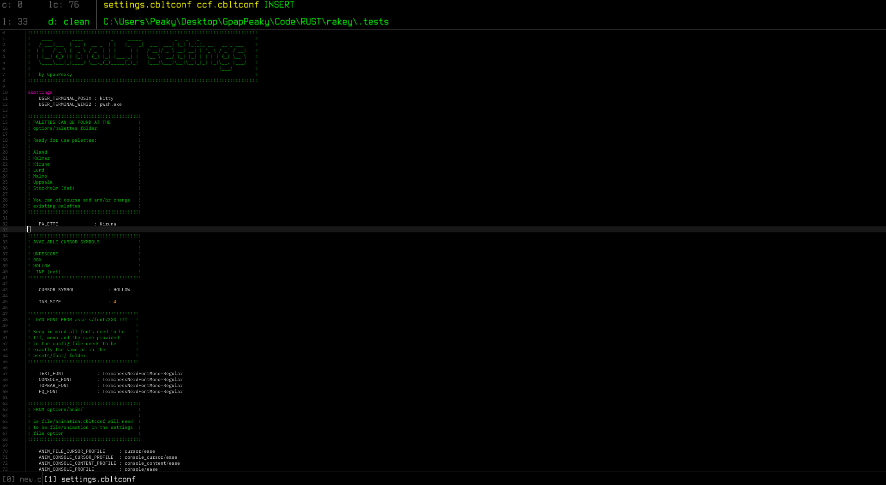
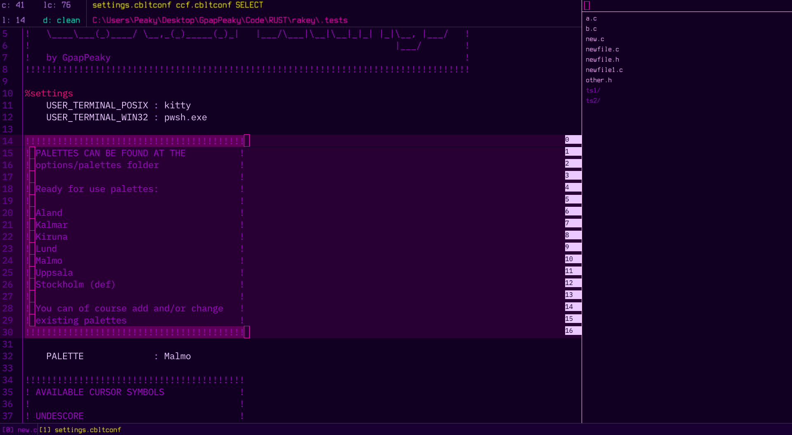
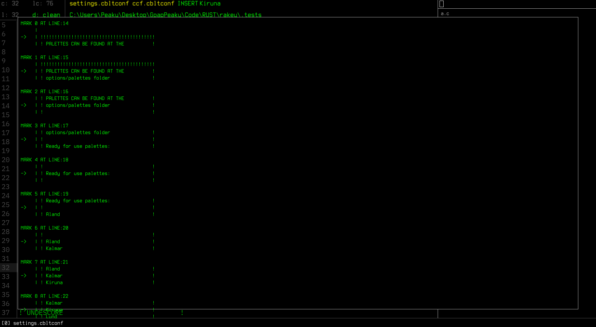

# CoBaLT (v2.1.1 Svedberg)

**The Console-Oriented Basic Line Transformer** is a lightweight, keyboard-driven text editor built on [raylib](https://www.raylib.com/). The philosophy behind CoBaLT is simple: modern editors are bloated, and Vim takes years to master. CoBaLT aims to capture the **lightweightness, customization, and visual simplicity** of modal editors like Vim, while remaining immediately approachable — no learning curve, no plugin ecosystem to maintain, no LSP daemon eating your RAM.

<p align="center">
  
</p>

<p align="center">
  <table align="center" width="100%" cellspacing="4" cellpadding="4" border="0">
    <tr>
      <td align="center" width="50%"></td>
      <td align="center" width="50%"></td>
    </tr>
    <tr>
      <td align="center" width="50%"></td>
      <td align="center" width="50%"></td>
    </tr>
  </table>
</p>

---

## Table of Contents

1. [Features](#1-features)
   - [Console Mode & Directives](#11-console-mode--directives)
   - [Insert Mode](#12-insert-mode)
   - [File Abstractions](#13-file-abstractions)
   - [File Queue & Virtual Filesystem](#14-file-queue--virtual-filesystem)
   - [Markings](#15-markings)
   - [Animation System](#16-animation-system)
   - [Sound System](#17-sound-system)
   - [Cross-Platform Support](#18-cross-platform-support)
2. [Directives Reference](#2-directives-reference)
3. [Keyboard Shortcuts](#3-keyboard-shortcuts)
4. [Configuration](#4-configuration)
5. [Building & Installation](#5-building--installation)
6. [License](#6-license)
7. [Credits](#7-credits)

---

## 1. Features

### 1.1 Console Mode & Directives

Press `` Ctrl+` `` at any time to open the console. The console operates on a single-line internal `File` object — the same abstraction used for every other file in the editor — which means cursor movement, backspace, and history all work exactly as they do in the editor itself.

Directives fall into four categories:

#### 1.1.1 Switch-to-File / Enqueue (NQ) Directives

Typing a filename (without a leading `:`) and pressing Enter enqueues it into the **FileQueue**. The console filters the current directory's contents in real time as you type, so you can Tab-complete to the first matching entry. Clicking a file or directory in the console panel works the same way.

#### 1.1.2 Command Directives

Prefixed with `:`, these cover file management, navigation, system integration, and editor control. The most common ones are also bound to keyboard shortcuts. See the full [Directives Reference](#2-directives-reference) below.

#### 1.1.3 Directive History

Every invoked directive (valid or not) is pushed to a **doubly-linked list** capped at 100 entries. Navigate it with `↑`/`↓` while the console is open. When the cap is reached the oldest entry is evicted from the back.

#### 1.1.4 Console Autocomplete

Pressing `Tab` in the console completes to the first matching CWD entry. For `:cd`, only directories are offered. For bare filenames, all entries whose names start with the current input are listed in the console panel and highlighted as you type.

#### 1.1.5 Console CWD Panel

The right-hand console panel always shows the contents of the current working directory, filtered and scrollable. The currently open file is highlighted in a distinct colour. You can scroll the panel with `Shift+↑`/`↓` or the mouse wheel, and resize the console with `Shift+←`/`→`.

---

### 1.2 Insert Mode

Insert mode is where all in-file editing happens. It supports:

#### 1.2.1 Multi-Cursor Support

Add a cursor on the line above with `Ctrl+Alt+↑` and below with `Ctrl+Alt+↓`. All active cursors receive the same keystrokes simultaneously. Remove secondary cursors with `Ctrl+P` to return to a single primary cursor. Multi-cursor indentation and end-of-file deletion are known to have rough edges and are marked as experimental.

#### 1.2.2 Auto-Indentation & Bracket Pairing

On `Enter`, the editor counts unmatched `{` braces above the cursor and indents the new line to the appropriate depth (scaled by `TAB_SIZE`). Typing any of `{`, `(`, or `[` automatically inserts the matching closer and positions the cursor between the pair. Typing a closer when one already exists under the cursor moves past it instead of doubling up.

#### 1.2.3 Selection Mode

Hold `Shift` while pressing any arrow key to enter **selection mode**. The selection is rendered as a coloured rectangle across the affected lines. While in selection mode:
- Any printable character replaces the selection.
- `Backspace` or `Ctrl+X` deletes the selection.
- `Ctrl+C` copies the selected text to the system clipboard.
- `Ctrl+V` replaces the selection with clipboard contents.
- A bare arrow key or `Escape` exits selection mode without modifying text.

#### 1.2.4 Cursor Fragment Display

The word under (or immediately behind) the cursor is extracted on every frame and shown in the top bar. This "fragment" is also the seed used by the autocomplete engine.

#### 1.2.5 Infile Autocomplete

As you type, the autocomplete engine scans the current file's identifier tokens and the loaded language's keyword set for entries that share the cursor fragment as a prefix. A floating suggestion box (up to 6 visible entries, scrollable) appears next to the cursor. Navigate it with `↑`/`↓` and confirm with `Tab`. The box closes automatically on navigation, non-alphanumeric input, or `Escape`. Suggestions are sourced from:

- All `TokenClass::ID` tokens in the open file, tracked per-line in an `unordered_set`.
- All keyword sub-categories from the loaded `.cbltconf` language file (control flow, data types, storage class, type qualifiers, user-defined class keywords, utility keywords).

The suggestion index resets whenever the fragment changes, and the dismissed state prevents the box from re-opening until the next valid character is typed.

---

### 1.3 File Abstractions

Every piece of text the editor touches — including the console's own input line — is an instance of the `File` class. Even a brand-new file created with `:c` is constructed in memory first and only written to disk on `:w`.

#### 1.3.1 Internal Representation

A `File` stores:
- `lines` — `std::vector<std::string>`, the raw text content.
- `tokens` — a parallel 2D vector (`vector<vector<Token>>`), one token list per line.
- `lineStates` — per-line `LexerState` seeds so block comments propagate correctly across lines.
- `dirtyLines` — an `unordered_set<uint32_t>` of lines modified since the last retokenization pass.
- A `CursorManager` owning all active cursors for that file.
- An `InfileAutocomplete` instance with its own per-line token sets.
- An `InfileMark` vector, saved to and loaded from a sidecar `.marks` file on disk.
- A `Camera` and `Offset` pair controlling the scroll position of the viewport.

#### 1.3.2 Syntax Highlighting & Language Support

CoBaLT ships language definitions for **61 file extensions**, from C and C++ through Rust, Zig, Go, Python, JavaScript/TypeScript, GLSL, WGSL, GDScript, SQL, YAML, Markdown, and more. Each definition lives in a `.cbltconf` file under `meta/lang/` and declares:

| Section | Purpose |
|---|---|
| `%keywords:` | Sub-categories: control flow, storage class, type qualifiers, user-defined class, utility, data types |
| `%operators:` | Operator strings to highlight |
| `%punctuation:` | Punctuation strings |
| `%commentBlock:` | Open/close pairs (e.g. `/* */`) |
| `%commentLine:` | Line comment prefixes (e.g. `//`) |
| `%stringDelim:` | Open/close string delimiters |
| `%macros:` | Macro prefixes (e.g. `#`) |
| `%annotations:` | Annotation prefixes (e.g. `@`) |
| `%settings:` | Per-language flags: `mls`, `hex`, `bin`, `esc` |

Token colours are assigned per `TokenClass` and read from the active **palette** file, so the entire colour scheme can be swapped at runtime with `:pal <name>`.

#### 1.3.3 Tokenization & Dirty-Line Retokenization

On file load, `Tokenize()` does a full single-pass scan using `LexLine()`. From that point on, only lines in `dirtyLines` are re-scanned — `RetokenizeDirtyLines()` finds the earliest dirty line, inherits the correct `LexerState` seed from the line above, and propagates forward until the lexer state stabilises or the end of the file is reached. This keeps editing responsive even in large files.

---

### 1.4 File Queue & Virtual Filesystem

The **FileQueue** holds up to 32 simultaneously open `File` instances. It is the only way files are accessed by the controller — there is no concept of a "global current file" outside of `FileQueue::Active()`.

Files in the queue are in-memory copies. This means:
- Deleting a file from disk while it is enqueued does not close it.
- Saving a deleted file recreates it on disk.
- Newly created files (`:c <name>`) are enqueued immediately.

The queue is displayed as a tab strip at the bottom of the screen, with the active file highlighted. It scrolls horizontally with `Ctrl+Alt+←/→` or the `Ctrl+Alt` scroll shortcuts.

#### 1.4.1 Queue Operations

| Directive | Effect |
|---|---|
| `:q` | Dequeue current file (no write) |
| `:wq` | Write then dequeue current file |
| `:qa` | Dequeue all files |
| `:qas` | Dequeue only clean (saved) files |
| `:wqa` | Write all then dequeue all |
| `Ctrl+.` | Switch to next file |
| `Ctrl+,` | Switch to previous file |

---

### 1.5 Markings

Marks are persistent line bookmarks. They survive between sessions via hex-encoded sidecar files stored in `<resources>/meta/marks/`. The filename is derived from the full file path, encoded to avoid collisions between files of the same name in different directories.

Mark IDs are always contiguous — removing any mark triggers a full reindex so IDs are never gapped.

```
:mat <l>   Mark line l (or Ctrl+M on cursor line)
:umat <l>  Unmark line l (or Ctrl+M on already-marked line)
:gm <id>   Jump to mark by ID
:gml       Jump to the last mark
:uml       Remove the last mark
:uma       Remove all marks
:im        Display all marks with surrounding context lines
```

Marks are rendered as small ID-labelled rectangles on the right edge of the file view, visible at a glance without obscuring text.

---

### 1.6 Animation System

CoBaLT uses an `Animator` class backed by a linear `Interpolator` to smoothly move UI elements — primarily cursors. Each animator is driven by an `AnimationProfile` that specifies:

| Field | Description |
|---|---|
| `ease` | `NONE`, `LINEAR`, `EASE_IN`, `EASE_OUT`, `ELASTIC`, `BOUNCE` |
| `speed` | Progress increment per frame (0.0 – 1.0) |
| `overshoot` | How far past the target elastic/bounce animations travel |
| `stiffness` | Controls curvature for linear and ease variants |
| `damping` | Controls oscillation decay for `ELASTIC` |

Profiles are loaded from `.cbltconf` files under `options/anim/` and assigned in `settings.cbltconf` via the `ANIM_*_PROFILE` keys. The following elements have independent profiles:

- File cursors (`ANIM_FILE_CURSOR_PROFILE`)
- Console cursor (`ANIM_CONSOLE_CURSOR_PROFILE`)
- File queue camera (`ANIM_FQ_PROFILE`)
- Console panel (`ANIM_CONSOLE_PROFILE`)
- Console CWD content panning (`ANIM_CONSOLE_CONTENT_PROFILE`)

---

### 1.7 Sound System

Every discrete editor action plays a short audio cue through raylib's audio device. Sounds are loaded from `assets/audio/` at startup and each playback applies a small random pitch variation (`±~0.4 semitones`) to prevent monotony. Sound categories include:

- **Infile**: insert, delete, space, navigation, return
- **Console**: open, close, execute, file switch, error, info, guide
- **File queue**: traversal, dequeue
- **System**: exit

---

### 1.8 Cross-Platform Support

CoBaLT targets **Linux**, **macOS**, and **Windows**. Platform-specific code is isolated to dedicated translation units:

| Module | Linux | macOS | Windows |
|---|---|---|---|
| `CBLT_Dialog` | zenity / kdialog / yad / dialog / whiptail fallback chain | `osascript` | `IFileDialog` (COM) |
| `CBLT_ShellBridge` | `fork` + `execlp` into user-configured terminal | same | `CreateProcessA` into cmd / PowerShell / wt |
| `CBLT_Sys::ResourcePath` | `$CBLT_RESOURCES` env var | relative `.` | relative `.` |
| `CBLT_raylib.hpp` | absolute path include | — | absolute path include |

The terminal used by the shell bridge is configured in `settings.cbltconf` via `USER_TERMINAL_POSIX` and `USER_TERMINAL_WIN32`.

---

## 2. Directives Reference

All command directives begin with `:`. Parameters are separated by a single space.

### File & Buffer

| Directive | Description |
|---|---|
| `:w` | Write (save) the current file |
| `:we` | Write and exit the editor |
| `:wq` | Write and close the current file |
| `:wqa` | Write and close all open files |
| `:q` | Close (dequeue) current file without saving |
| `:qa` | Close all files without saving |
| `:qas` | Close only clean (saved) files |
| `:c <name>` | Create a new file and enqueue it |
| `:r <name>` | Delete a file from disk |
| `:i` | Display current file metadata (path, line count, dirty state) |

### Navigation

| Directive | Description |
|---|---|
| `:g <l>` | Go to line `l` |
| `:gs` | Go to start of file |
| `:ge` | Go to end of file |
| `:f <token>` | Find first occurrence of identifier `token` |
| `:gm <id>` | Go to mark by ID |
| `:gml` | Go to the last mark |

### Directory

| Directive | Description |
|---|---|
| `:cd <path>` | Change working directory (Tab-completable) |
| `:up` | Go to parent directory (alias for `:cd ..`) |
| `:m <name>` | Create a directory |
| `:d <name>` | Delete a directory and all its contents |
| `:o` | Open the native OS folder picker |

### Marks

| Directive | Description |
|---|---|
| `:mat <l>` | Mark line `l` |
| `:umat <l>` | Unmark line `l` |
| `:uml` | Unmark the last mark |
| `:uma` | Unmark all marks |
| `:im` | Show all marks with surrounding context |

### Editor & System

| Directive | Description |
|---|---|
| `:h` | Show the help guide |
| `:sh <cmd>` | Open a local shell session in the current working directory |
| `:pal <name>` | Switch the active colour palette |
| `:set` | Open `settings.cbltconf` in the editor |
| `:log` | Open `dir.log` in the editor |
| `:rst` | Reload `settings.cbltconf` and apply all settings |
| `:msg <text>` | Display an info message |
| `:e` | Exit the editor |

---

## 3. Keyboard Shortcuts

### General

| Shortcut | Action |
|---|---|
| `` Ctrl+` `` | Toggle console |
| `Ctrl+E` | Exit |
| `Ctrl+W` | Write active file and exit |
| `Ctrl+S` | Save active file |
| `Ctrl+H` | Show help guide |
| `Ctrl+O` | Open native folder picker |
| `Ctrl+I` | Show file info |
| `Escape` | Dismiss autocomplete / clear console message |

### Navigation

| Shortcut | Action |
|---|---|
| `↑` `↓` `←` `→` | Move cursor |
| `Ctrl+←` / `Ctrl+→` | Move to previous / next word boundary |
| `Ctrl+G` | Go to end of file |
| `Ctrl+Shift+G` | Go to start of file |
| `Ctrl+F` | Open console pre-filled with `:f ` (token search) |
| `Ctrl+.` | Switch to next file in queue |
| `Ctrl+,` | Switch to previous file in queue |
| `Ctrl+Alt+←/→` | Scroll file queue tab strip |

### Editing

| Shortcut | Action |
|---|---|
| `Ctrl+X` | Cut (delete) current line to clipboard |
| `Ctrl+C` | Copy selection to clipboard |
| `Ctrl+V` | Paste from clipboard |
| `Ctrl+/` | Toggle `//` comment on current line |
| `Alt+↑` | Swap current line with the line above |
| `Alt+↓` | Swap current line with the line below |
| `Shift+Alt+↑` | Duplicate current line above |
| `Shift+Alt+↓` | Duplicate current line below |
| `Ctrl+-` | Decrease font size |
| `Ctrl+=` | Increase font size |

### Multi-Cursor

| Shortcut | Action |
|---|---|
| `Ctrl+Alt+↓` | Add cursor on line below |
| `Ctrl+Alt+↑` | Add cursor on line above |
| `Ctrl+P` | Remove all secondary cursors |

### Marks

| Shortcut | Action |
|---|---|
| `Ctrl+M` | Add mark on cursor line (or remove if already marked) |

### Console

| Shortcut | Action |
|---|---|
| `↑` / `↓` | Navigate directive history |
| `Tab` | Autocomplete filename or directory |
| `Shift+←` / `Shift+→` | Resize console panel |
| `Shift+↑` / `Shift+↓` | Scroll CWD content panel |
| `Escape` | Clear displayed message |

---

## 4. Configuration

All configuration lives under the editor's resource directory, resolved via `$CBLT_RESOURCES` on Linux or relative to the executable on macOS and Windows.

### 4.1 `options/settings.cbltconf`

```
%settings
TAB_SIZE              : 4
CURSOR_SYMBOL         : UNDERSCORE        ! BOX | LINE | HOLLOW | UNDERSCORE
PALETTE               : default
USER_TERMINAL_POSIX   : xterm
USER_TERMINAL_WIN32   : powershell.exe
ANIM_FILE_CURSOR_PROFILE     : cursor/ease
ANIM_CONSOLE_CURSOR_PROFILE  : console_cursor/ease
ANIM_CONSOLE_CONTENT_PROFILE : console_content/ease
ANIM_CONSOLE_PROFILE         : console/ease
ANIM_FQ_PROFILE              : fq/ease
%settings
```

Open the settings file from inside the editor with `:set` and reload without restarting using `:rst`.

### 4.2 Palettes

Palette files live in `options/palettes/<name>.pal`. Switch at runtime with `:pal <name>`. Every colour entry uses `[r, g, b]` notation inside a `%pal` block. Derivable values (`cursorPosHighlight`, `selectionColor` alpha) are recomputed automatically after loading.

### 4.3 Animation Profiles

Profile files live in `options/anim/<type>/<name>.cbltconf`. Each file exposes:

```
%anim
ease       : EASE_OUT
speed      : 0.18
overshoot  : 0.0
stiffness  : 0.6
damping    : 1.0
%anim
```

as well as these ease types:

```
NONE
LINEAR
EASE_OUT
EASE_IN
ELASTIC
BOUNCE
```

### 4.4 Language Definitions

Language files live in `meta/lang/<ext>.cbltconf`. To add a new language, create a file following the existing format and add a mapping to `gLangFiles` in `CBLT_Language.cpp` alongside a `FileExtension` enumerator in `CBLT_FileExtension.hpp`.

### 4.5 Fonts

Font names and sizes live in `options/fonts.cbltconf`. To change one of the fonts, the name in the config file must match exactly the name of the `<name>.tff` file inside the `assets/font/` folder. Currently the editor uses `IBMPlexMono-Regular` as it's default font.

---

## 5. Building & Installation

### Linux

Download and extract the release archive, then run the install script:

```sh
tar -xzvf cblt-linux-x86_64.tar.gz
cd cblt-linux-x86_64/
sh ./install.sh
```

The install script sets `$CBLT_RESOURCES` and places the binary on your `$PATH`. The editor is launched with an optional working directory argument:

```sh
cblt /path/to/your/project
```

If no argument is given, the working directory defaults to `/home`.

### macOS

CoBaLT uses relative paths on macOS, so run the binary from the directory containing the `assets/` and `meta/` folders:

```sh
cd /path/to/cblt
./cblt /path/to/your/project
```

### Windows (64-bit)

Download the compiled build from the **Releases** section. raylib and all sources must be compiled with a **64-bit compiler**. Run the executable from the directory containing `assets\` and `meta\`.

---

## 6. License

```
Creative Commons Attribution-NonCommercial-ShareAlike 4.0 International

Copyright (c) 2025 CoBaLT Project Contributors

You are free to:
  Share  — copy and redistribute the material in any medium or format
  Adapt  — remix, transform, and build upon the material

Under the following terms:
  Attribution     — Give appropriate credit and indicate if changes were made.
  NonCommercial   — You may not use the material for commercial purposes.
  ShareAlike      — Distribute adaptations under the same license.
  No extra locks  — You may not apply terms that legally restrict others
                    from doing what the license permits.

Full text: https://creativecommons.org/licenses/by-nc-sa/4.0/legalcode
```

---

## 7. Credits

**Developed by GpapPeaky | Giorgos Papamatthaiakis**

Built with [raylib](https://www.raylib.com/) — a simple and easy-to-use library to enjoy videogames programming.
