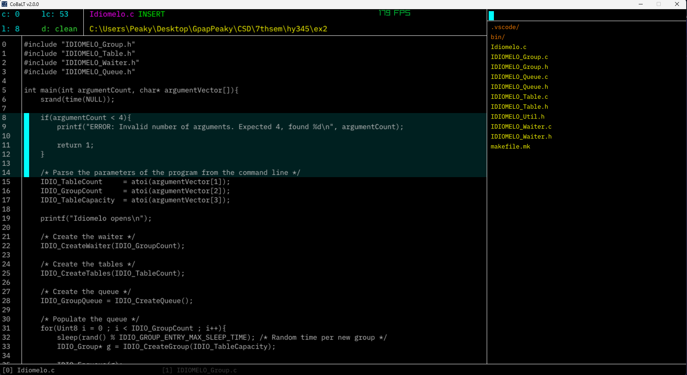

# CoBaLT (v2.0.0)

**The Console-Oriented Basic Line Transformer** (formerly known as Muse) is a lightweight console-based editor that allows users to manage files, directories, and editor configurations directly from a command-line interface. The editor supports switching between console mode and insert mode seamlessly, along with a wide range of file, directory, and editor management directives.

<p align="center">
  
</p>

<p align="center">
  
</p>

---

## Features

- **Console Mode**: Execute directives for file and directory management
- **Insert Mode**: Full-featured text editing with syntax-aware features
- **Multi-cursor Support**: Edit multiple locations simultaneously
- **Selection Mode**: Copy and manipulate text selections
- **Smart Indentation**: Automatic bracket matching and indentation
- **File Queue**: Manage multiple open files with easy switching

---

## Keyboard Shortcuts

### General Editor Controls

| Shortcut | Action |
|----------|--------|
| `Ctrl + E` | Exit CoBaLT |
| `Ctrl + W` | Save current file and exit |
| `Ctrl + S` | Save current file |
| `Ctrl + ~` | Toggle console mode |
| `Esc` | Close console messages |

### File Navigation

| Shortcut | Action |
|----------|--------|
| `Ctrl + .` | Switch to next loaded file |
| `Ctrl + ,` | Switch to previous loaded file |
| `Ctrl + Q` | Close current file (remove from queue) |
| `Ctrl + O` | Open native folder picker |
| `Ctrl + I` | Display current file info and metadata |

### Cursor Movement

| Shortcut | Action |
|----------|--------|
| `Arrow Keys` | Move cursor in respective direction |
| `Ctrl + Left/Right` | Jump to word boundaries |
| `Home` | Move to start of line |
| `End` | Move to end of line |

### Multi-cursor Operations

| Shortcut | Action |
|----------|--------|
| `Ctrl + Alt + Down` | Create cursor below |
| `Ctrl + Alt + Up` | Create cursor above |
| `Ctrl + P` | Reset to single primary cursor |

### Editing Operations

| Shortcut | Action |
|----------|--------|
| `Ctrl + X` | Cut current line (or delete and copy to clipboard) |
| `Ctrl + D` | Duplicate current line |
| `Ctrl + V` | Paste from clipboard |
| `Ctrl + /` | Toggle line comment (add/remove `//`) |
| `Tab` | Insert spaces (auto-aligned to tab stops) |
| `Backspace` | Delete character or indentation block |
| `Enter` | New line with auto-indentation |

### Selection Mode

| Shortcut | Action |
|----------|--------|
| `Ctrl + K` | Enter selection mode |
| `Ctrl + K` (again) | Copy selection and exit selection mode |
| `Ctrl + C` | Copy selection and exit selection mode |

### Console Resizing

| Shortcut | Action |
|----------|--------|
| `Shift + Left` | Expand console width |
| `Shift + Right` | Shrink console width |

---

## Console Directives

Console directives are prefixed with `@` and executed in console mode (`Ctrl + ~`). Files can also be opened by typing their name directly (without `@`).

### File Management

| Directive | Parameters | Description |
|-----------|------------|-------------|
| `@c` | `<filename>` | Create a new file |
| `@r` | `<filename>` | Remove/delete a file |
| `@w` | - | Write/save current file |
| `<filename>` | - | Switch to an existing file in current directory |

### Directory Management

| Directive | Parameters | Description |
|-----------|------------|-------------|
| `@m` | `<dirname>` | Make/create a new directory |
| `@d` | `<dirname>` | Delete a directory (recursive) |
| `@cd` | `<path>` | Change to specified directory |
| `@cd` | `..` | Go up one directory level |

### Editor Commands

| Directive | Parameters | Description |
|-----------|------------|-------------|
| `@e` | - | Exit CoBaLT |
| `@we` | - | Write current file and exit |
| `@h` | - | Display help guide |
| `@i` | - | Display current file info and metadata |
| `@o` | - | Open native folder picker dialog |

---

## Usage Examples

### Creating and Editing Files

```
1. Press Ctrl + ~ to open console
2. Type: @c myfile.txt
3. Press Enter
4. Start editing in insert mode
5. Press Ctrl + S to save
```

### Directory Navigation

```
1. Press Ctrl + ~ to open console
2. Type: @cd src
3. Press Enter to navigate to 'src' directory
4. Type: @cd .. to go back up
```

### Working with Multiple Files

```
1. Open file: myfile.txt
2. Press Ctrl + . to switch to next file
3. Press Ctrl + , to switch to previous file
4. Press Ctrl + Q to close current file
```

### Multi-cursor Editing

```
1. Press Ctrl + Alt + Down to create cursors on lines below
2. Type to edit all cursor positions simultaneously
3. Press Ctrl + P to return to single cursor
```

### Selection and Copy

```
1. Press Ctrl + K to enter selection mode
2. Use arrow keys to select text
3. Press Ctrl + K or Ctrl + C to copy and exit selection
4. Press Ctrl + V to paste
```

---

## Smart Editing Features

### Auto-bracket Completion

When typing opening brackets, CoBaLT automatically inserts the closing bracket:
- `{` → `{}`
- `(` → `()`
- `[` → `[]`

### Smart Indentation

When pressing Enter after an opening brace `{`, CoBaLT automatically:
1. Creates a new indented line
2. Positions cursor at the correct indentation level
3. Adds a closing brace `}` on the next line with proper indentation

### Comment Toggling

`Ctrl + /` intelligently toggles C++ style comments:
- Empty line: Adds `//`
- Line with `//`: Removes the comment marker
- Line without `//`: Adds comment at the start

---

## Console Messages

CoBaLT displays different types of console messages:

- **INFO** (Green): Successful operations and status updates
- **ERROR** (Red): Failed operations and invalid commands
- **GUIDE** (Yellow): Help information and command reference

Press `Esc` to dismiss any active message.

---

## File Queue System

CoBaLT maintains a queue of open files:
- Use `Ctrl + .` and `Ctrl + ,` to navigate between files
- Use `Ctrl + Q` to close the current file
- The console shows files in the current directory
- Type a filename in console mode to quickly switch to it

---

## Tips and Best Practices

1. **Quick File Switching**: In console mode, start typing a filename - the list automatically filters to matching files
2. **Multi-cursor Power**: Use `Ctrl + Alt + Up/Down` to create cursors, then edit multiple lines at once
3. **Smart Navigation**: Use `Ctrl + Left/Right` to jump between words quickly
4. **Console Filtering**: When in console mode, typing filters the file/directory list in real-time
5. **Indentation Blocks**: Backspace automatically removes tab-sized blocks of spaces for cleaner editing

---

## Building and Installation

>You can personally build this project in git bash by typing sh scripts/make.mk or by executing make -f make.mk in the root diretory.

---

## License

```
Creative Commons Attribution-NonCommercial-ShareAlike 4.0 International License

Copyright (c) 2025 CoBaLT Project Contributors

================================================================================

This work is licensed under the Creative Commons Attribution-NonCommercial-ShareAlike 4.0 International License.

You are free to:

  * Share — copy and redistribute the material in any medium or format
  * Adapt — remix, transform, and build upon the material

Under the following terms:

  * Attribution — You must give appropriate credit, provide a link to the 
    license, and indicate if changes were made. You may do so in any 
    reasonable manner, but not in any way that suggests the licensor 
    endorses you or your use.

  * NonCommercial — You may NOT use the material for commercial purposes.

  * ShareAlike — If you remix, transform, or build upon the material, you 
    must distribute your contributions under the same license as the original.

  * No additional restrictions — You may not apply legal terms or 
    technological measures that legally restrict others from doing anything 
    the license permits.

Notices:

You do not have to comply with the license for elements of the material in 
the public domain or where your use is permitted by an applicable exception 
or limitation.

No warranties are given. The license may not give you all of the permissions 
necessary for your intended use. For example, other rights such as publicity, 
privacy, or moral rights may limit how you use the material.

================================================================================

For commercial licensing inquiries, please contact: [your-email@example.com]

Full license text available at:
https://creativecommons.org/licenses/by-nc-sa/4.0/legalcode

```

---

## Credits

**Developed by GpapPeaky | Giorgos Papamatthaiakis**